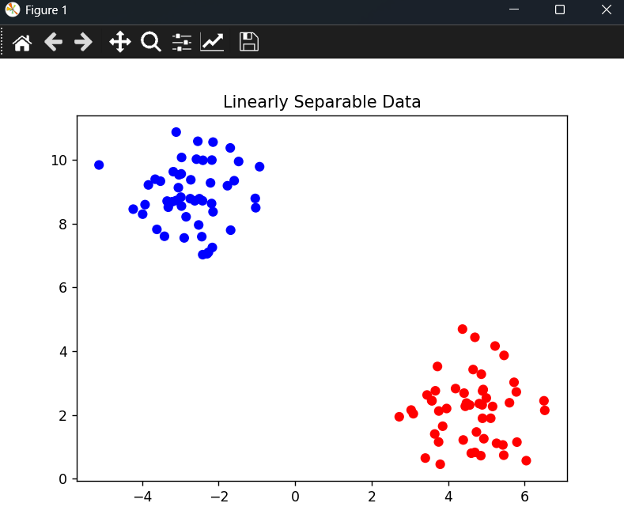
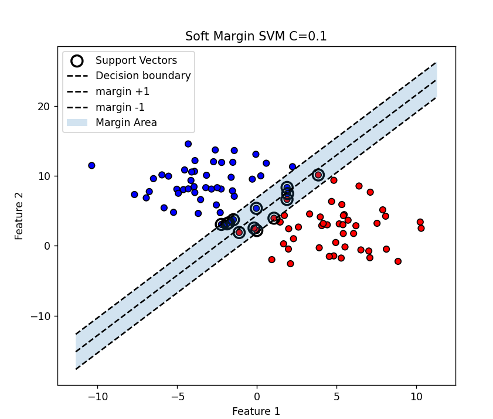
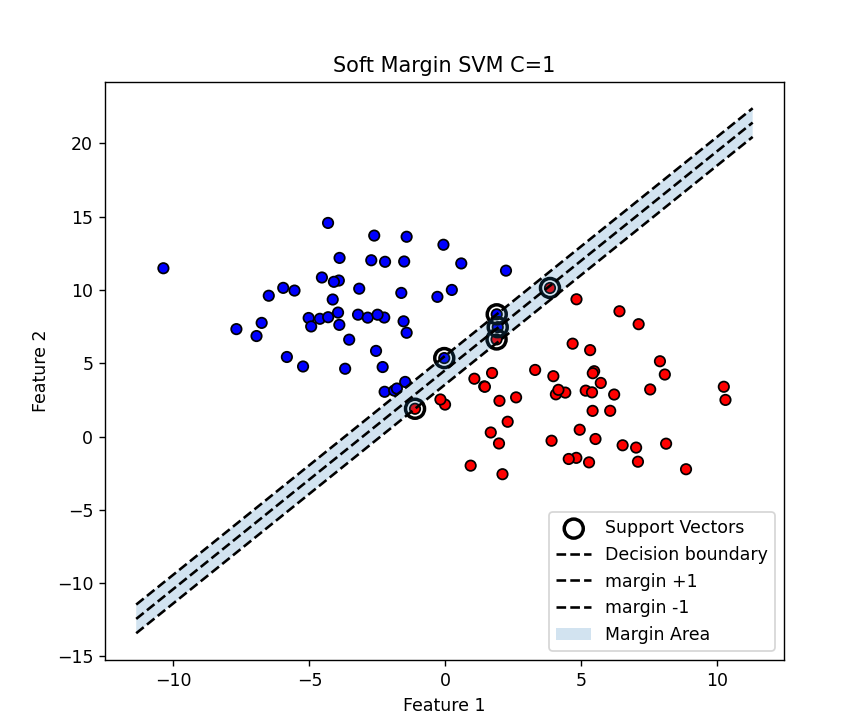
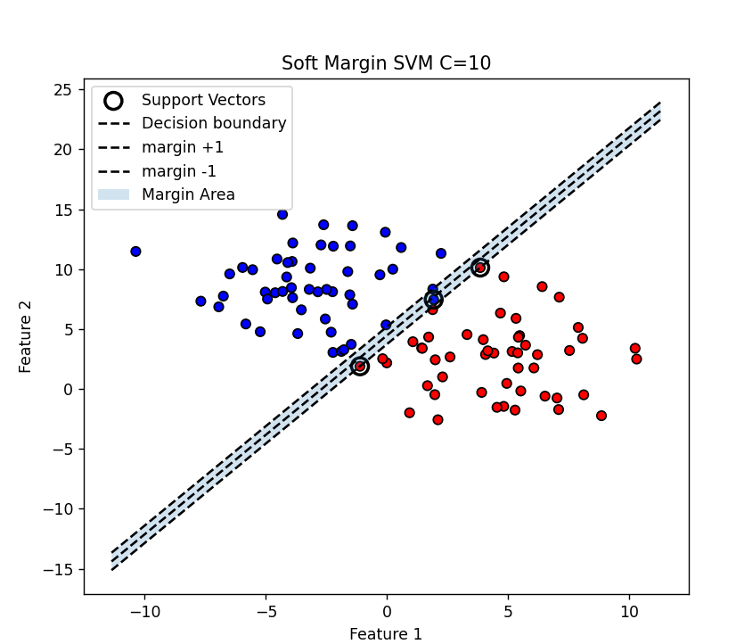

# Support Vector Machines (Hard & Soft Margin)

This project demonstrates the implementation and visualization of **Hard Margin** and **Soft Margin Support Vector Machines (SVM)** using Python and Scikit-learn. The work is structured in an **industry-style modular format** with separate files for data generation, visualization, experiments, and execution.

---

## Project Objectives

* Generate linearly separable and overlapping datasets.
* Train Hard Margin SVM.
* Train Soft Margin SVM with different values of **C**.
* Visualize decision boundary, margins, and support vectors.
* Compare the effect of regularization parameter **C**.

---

##  Project Structure

```
svm_lab2/
│
├── data_generation.py
├── visualization.py
├── hard_margin.py
├── soft_margin_c01.py
├── soft_margin_c1.py
├── soft_margin_c10.py
├── main.py
└── requirements.txt
```

---

##  Requirements

Install dependencies using:

```bash
pip install numpy matplotlib scikit-learn
```

---

## How to Run the Project

Run all experiments at once:

```bash
python main.py
```

Or run individual experiments:

```bash
python hard_margin.py
python soft_margin_c01.py
python soft_margin_c1.py
python soft_margin_c10.py
```

---

##  Experiments Included

### Hard Margin SVM

* Uses linearly separable data.
### Linearly Seperable Data





* Large value of **C = 1e6**.
* Produces maximum margin without misclassification.

###  Soft Margin SVM

| File               | C Value | Description                    |
| ------------------ | ------- | ------------------------------ |
| soft_margin_c01.py | 0.1     | Large margin, more tolerance   |
| soft_margin_c1.py  | 1       | Balanced margin                |
| soft_margin_c10.py | 10      | Smaller margin, less tolerance |

---

##  Output Visualizations


### Hard Margin Output


### Soft Margin C = 0.1





### Soft Margin C = 1





### Soft Margin C = 10




---
## Observations

* Smaller **C** gives wider margin with more misclassifications.
* Larger **C** forces stricter classification with smaller margin.
* Support vectors increase when data overlaps.

---
