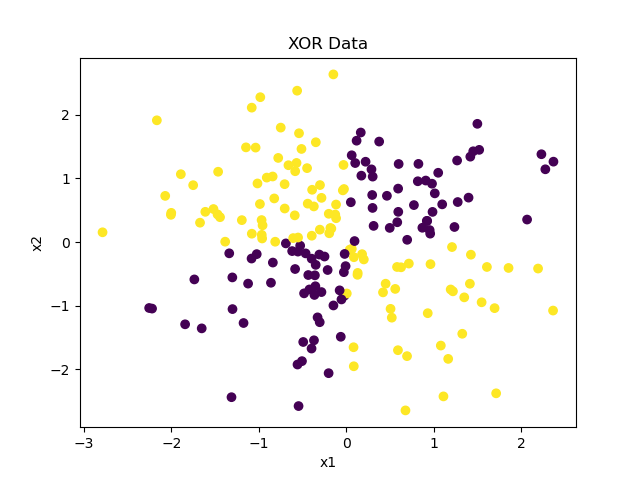
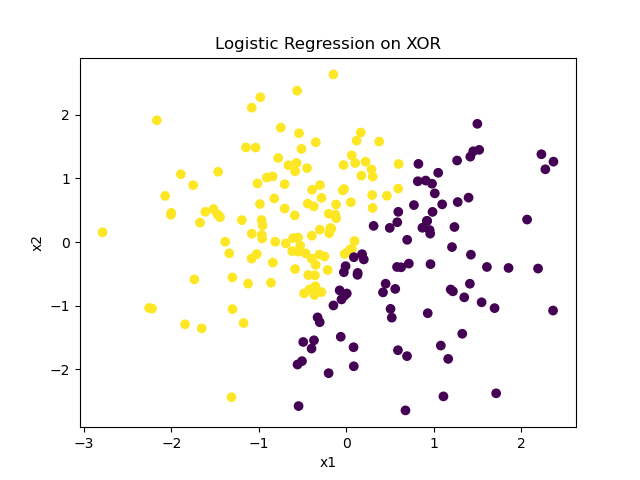
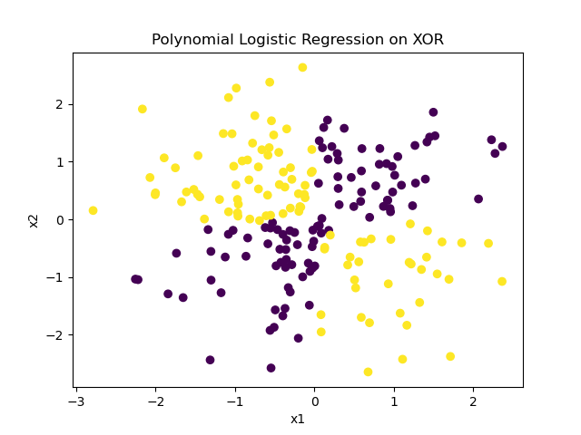
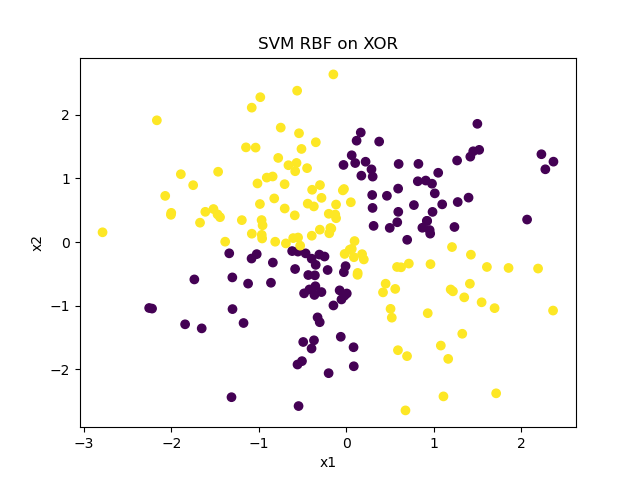

# Linear vs Non-Linear Classification (Logistic Regression & SVM)

## Overview

This project demonstrates the difference between **linear** and **non-linear** classification using:

* Logistic Regression
* Logistic Regression with Polynomial Features
* Support Vector Machine (SVM)

  * Linear Kernel
  * Polynomial Kernel
  * RBF Kernel

The project uses **synthetic datasets**:

* Linearly separable data
* XOR (non-linearly separable) data

The goal is to show **why linear models fail on non-linear data** and how **feature transformation and kernel methods solve this problem**.

---

## Folder Structure

```
main-folder/
│
├── data_generation.py        # Functions to generate linear and XOR data
├── visualization.py          # Function to plot 2D data
├── visualising_linear_data.py # to visulaise linear data
├── linear_data_demo.py       # Visualizes linearly separable data
├── xor_logistic_demo.py      # Logistic regression on XOR data
├── xor_svm_demo.py           # SVM with different kernels on XOR data
│
├── outputs/                  # Saved output images
│   ├── linear_data.png
│   ├── xor_original.png
│   ├── xor_logistic_linear.png
│   ├── xor_logistic_poly.png
│   ├── xor_svm_linear.png
│   ├── xor_svm_poly.png
│   └── xor_svm_rbf.png
│
└── README.md
```

---

## Data Generation

### Linear Data

* Generated using a simple linear rule
* Classes can be separated using a straight line


### XOR Data

* Generated using the XOR condition
* Not linearly separable
* Requires non-linear decision boundaries



---

## Results and Outputs

### 1. Linearly Separable Data

This dataset can be classified easily using linear models.


---

### 2. XOR Data (Original Space)

The XOR data cannot be separated by a straight line.


---

## Logistic Regression Results

### Logistic Regression (Without Feature Transformation)

* Uses a linear decision boundary
* Fails on XOR data

Accuracy is low because the data is non-linear.



---

### Logistic Regression with Polynomial Features

* Transforms data into higher-dimensional space
* Linear model can now separate the data

Accuracy improves significantly.



---

## Support Vector Machine (SVM) Results

### Linear Kernel SVM

* Similar to linear logistic regression
* Fails on XOR data


---

### Polynomial Kernel SVM

* Uses polynomial kernel
* Successfully separates XOR data


---

### RBF Kernel SVM

* Uses radial basis function kernel
* Creates flexible non-linear boundaries
* Performs very well on XOR data



---

## Key Takeaways

* Linear models work only for linearly separable data
* XOR data is non-linearly separable
* Polynomial features allow linear models to handle non-linear data
* Kernel SVMs handle non-linear data efficiently without manual feature transformation

---

## Requirements

* Python 3.x
* NumPy
* Matplotlib
* scikit-learn

---

## How to Run

1. Install dependencies:

```
pip install numpy matplotlib scikit-learn
```

2. Run the demo scripts:

```
python app.py

or

python linear_data_demo.py
python xor_logistic_demo.py
python xor_svm_demo.py
```

---

## Conclusion

This project clearly shows why **non-linear problems need non-linear solutions** and how **feature engineering and kernel methods** solve classification challenges.
